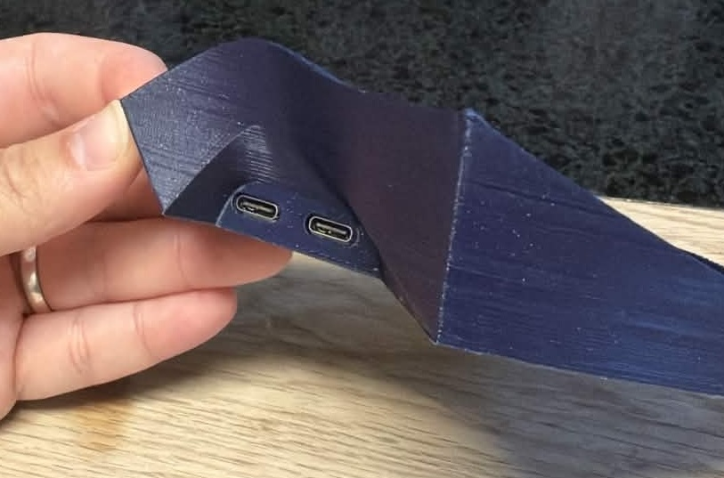
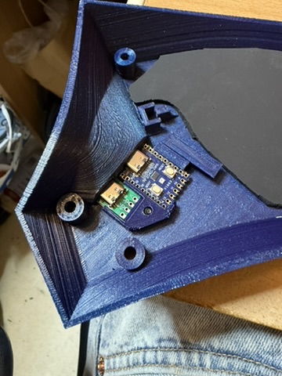
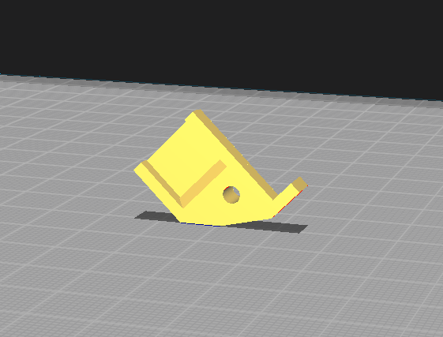
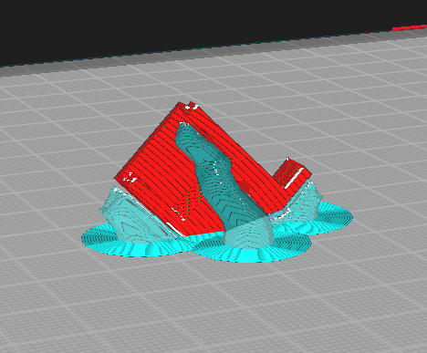

# Dactyl Cygnus 3x6 unified with USB-C interconnect

This modifications allows a USB-C interconnect instead of the TRRS-socket the original design uses.

Please note that you will need to use the included MCU-holder as the bracket inside of the case has been reworked for a smoother fit and hazzle-free print.

The included MCU-bracket is only available for the RP2040 Zero (and their clones), for other MCU's, you may modify the object inside of the included fusion-project.

## USB-C board

I used the following [USB-C board](https://www.aliexpress.com/item/1005010794414133.html), which are roughly 11.8-12.00mm by 13.8mm.

## Printing the holder

Please use support, I haven't printed the model without the support.

